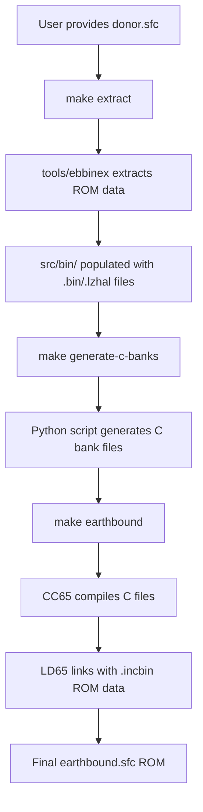

# EarthBound Pure C Build System - Phase 1

## Overview

Phase 1 implements a **Pure C build system** that eliminates ASM/C mixing complexity while maintaining copyright compliance. All game logic is implemented in C, with ROM data included via extraction from user-provided ROMs.

## Architecture

### Copyright-Safe Design
```
User's ROM (donor.sfc) → Extract Tool → src/bin/ (gitignored) → .incbin → Final ROM
         ↑                    ↑                ↑                    ↑
    Not in repo          tools/ebbinex    Generated files    CC65 build system
```

**Key Principles:**
- ✅ **No ROM data in repository** - users provide their own ROMs
- ✅ **Pure C compilation** - all game logic in maintainable C code  
- ✅ **Automated generation** - scripts generate C files from current progress
- ✅ **Copyright compliant** - only source code committed to repo

### Build System Flow



## File Structure

### Source Code (Committed to Repo)
```
src/
├── battle.c               # Battle system (converted from ASM)
├── audio.c                # Audio system (converted from ASM) 
├── system.c               # Core utilities (converted from ASM)
├── psi.c                  # PSI/magic system (converted from ASM)
├── inventory.c            # Item/equipment system (converted from ASM)
├── rom_data_c.c           # ROM data inclusion (generated)
└── generated/             # Generated C bank files
    ├── bank01.c           # Generated from bankconfig/US/bank01.asm
    ├── bank02.c           # Generated from bankconfig/US/bank02.asm
    └── ...
```

### ROM Data (Generated, Not Committed)
```
src/bin/                   # Extracted ROM data (gitignored)
├── maps/
│   ├── tiles/
│   │   ├── chunk_01.bin   # Tile graphics data
│   │   └── chunk_02.bin
│   └── arrangements/
│       └── 0.arr.lzhal    # Compressed map layouts
├── graphics/
│   ├── sprites/           # Character/enemy sprites
│   └── text_window.gfx.lzhal
├── audiopacks/            # Music and sound data
└── text_data/             # Message and dialogue data
```

### Build Configuration
```
snes_phase1.cfg            # Linker script for Pure C build
Makefile.phase1            # Pure C build system  
tools/generate_c_banks.py  # ASM→C bank file generator
```

## Build Commands

### Quick Start
```bash
# 1. Provide your EarthBound ROM
cp ~/earthbound.sfc donor.sfc

# 2. Extract ROM data  
make -f Makefile.phase1 extract

# 3. Generate C bank files from current ASM→C progress
make -f Makefile.phase1 generate-c-banks

# 4. Build final ROM
make -f Makefile.phase1 earthbound
```

### Development Workflow
```bash
# Check ROM data extraction status
make -f Makefile.phase1 check-rom-data

# Clean build (keeps extracted ROM data)
make -f Makefile.phase1 clean

# Test build and verify output
make -f Makefile.phase1 test-build

# Show available commands
make -f Makefile.phase1 help
```

## Technical Details

### C Bank File Generation

The `generate_c_banks.py` script analyzes existing ASM bank files and:

1. **Identifies converted functions** - checks which ASM functions have C implementations
2. **Maps ROM data references** - finds .INCBIN directives for data inclusion  
3. **Generates C bank files** - creates Pure C equivalents with proper segment placement

**Example Generated Bank:**
```c
#pragma code-name ("BANK01")
#include "battle.h"

// ✓ battle/bash_twice.asm → C function in src/battle.c
// ✓ battle/spy.asm → C function in src/battle.c 
// ⏳ battle/complex_spell.asm → Pending conversion

// ROM data inclusion
extern const unsigned char ROM_DATA_01_0[];
asm(".segment \"ROMDATA_GRAPHICS\"");
asm("ROM_DATA_01_0: .incbin \"src/bin/maps/tileset_01.bin\"");
```

### Memory Layout

**Critical Fixed Segments:**
- `BANK00` - System vectors and boot code (MUST stay at $C00000)
- `HEADER` - SNES ROM header (MUST stay at $C0FFB0) 

**Flexible C Code Segments:**
- `BANK01-05` - Main C code modules (can grow/shrink)
- Compiler can optimize within each segment

**Fixed ROM Data Segments:**
- `ROMDATA_GRAPHICS` - Graphics/sprite data via .incbin
- `ROMDATA_AUDIO` - Music/sound data via .incbin
- `ROMDATA_TEXT` - Messages/dialogue data via .incbin

### Copyright Compliance

**What's in the repository:**
- ✅ C source code (original implementations)
- ✅ Build scripts and tools
- ✅ Header files and structures  
- ✅ Documentation and guides

**What's NOT in the repository:**
- ❌ ROM data files (.bin, .lzhal, etc.)
- ❌ Donor ROM files  
- ❌ Generated ROM files (.sfc)
- ❌ Any copyrighted game assets

**User responsibilities:**
- Provide their own legal EarthBound ROM
- Run extraction process on their system
- Generated files are for personal use only

## Advantages of Pure C Build

### Development Benefits
- **No ASM/C mixing** - eliminates build complexity
- **Standard debugging** - can use GDB on C code
- **Modern tooling** - IDE support, static analysis
- **Easy refactoring** - standard C code practices
- **Clear separation** - code vs data boundaries

### Copyright Benefits  
- **Clean extraction** - no ROM data in source control
- **User-generated** - each user extracts their own data
- **Tool-based** - automated and repeatable process
- **Audit-friendly** - clear separation of code and assets

### Future Benefits
- **Cross-platform ready** - C code can target SDL/modern platforms
- **Optimization ready** - compiler can optimize across functions
- **Maintenance friendly** - standard C code practices
- **Extension friendly** - easy to add new features

## Migration from Current ASM Build

The Pure C build system is designed to coexist with the current ASM build:

1. **ASM build continues working** - existing Makefile.backup unchanged
2. **Progressive migration** - convert functions to C gradually  
3. **Validation** - compare outputs to ensure functional equivalence
4. **Final switch** - when all functions converted, switch to Pure C

**Current status tracking via file extensions:**
- `.converted.asm` - Function has C implementation  
- `.later.asm` - Complex function, defer conversion
- `.asm` - Not yet converted

The generator script tracks this progress and updates C bank files accordingly.

## Troubleshooting

### Common Issues

**"donor.sfc not found"**
- Solution: Place your EarthBound ROM as `donor.sfc` in project root

**"No such file: src/bin/..."**  
- Solution: Run `make extract` to generate ROM data files

**"CC65 compilation failed"**
- Check that all included C files exist and compile individually
- Verify ROM data files are extracted and accessible  

**"Link failed: undefined symbol"**
- Ensure all referenced functions have C implementations
- Check that system vectors are properly assembled

### Verification

**Test functional equivalence:**
```bash
# Build with both systems
make -f Makefile.backup earthbound    # ASM build → earthbound_asm.sfc  
make -f Makefile.phase1 earthbound    # C build → earthbound.sfc

# Compare behavior (not bit-identical, but functionally equivalent)
emulator_test earthbound_asm.sfc earthbound.sfc
```

**Check build artifacts:**
```bash
ls -la build/                      # Should contain .o files and .map
file build/earthbound.sfc          # Should be valid SNES ROM
hexdump -C build/earthbound.sfc | head   # Check ROM header
```

## Future Enhancements (Phase 2+)

The Pure C build system provides the foundation for:

- **Structured data formats** - JSON/PNG instead of binary data
- **Cross-platform builds** - SDL executable targets  
- **Modern asset tools** - visual editors, hot-reload
- **Enhanced debugging** - source-level debugging support
- **Performance optimization** - compiler-driven optimizations

See `DATA_STRATEGY.md` for the complete multi-phase roadmap.